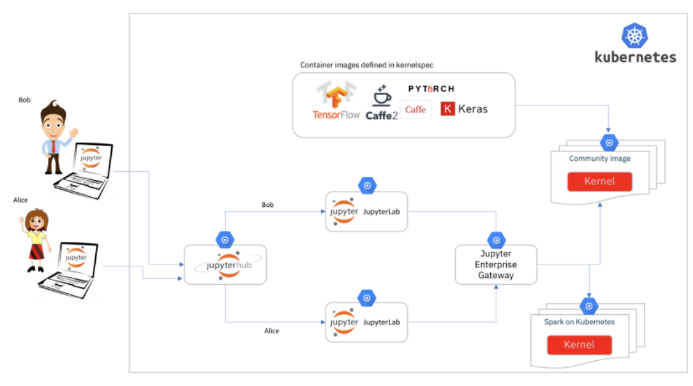
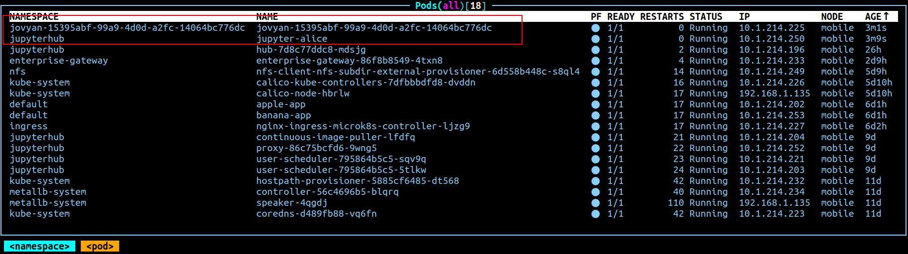

# Demo : Notebook as a Service  
## _Integration of Jupyterhub (Jhub) & Jupyter Enterprise Gateway (JEG)_

### LAB Objective:
Demonstarte steps to realize Jupyter notebook as a service using Jupyter Enterprise Gateway(JEG) & Jupyterhub (JHub) to realize separation of Jupyter server (backend of JupyterLab) and (computation) Kernels.
### LAB Overview:
* Deploy JEG & JHub on single node Microk8s cluster.
* Simulate users access Jupyterhub via their browsers . Jupyterhub launches server (JupyterLab backend) pod for each individual user. When a user tries to connect to a kernel, the server will acts as a proxy to spawn a kernel Pod in a separate namespace which is separate from server Pod. All these Pods are managed by a K8s cluster. When a user shutdowns kernel, the kernel pod will be destroyed . When a user shutdowns server, server Pod will be destroyed. But, a PVC (bound to a PV backed by a NFS share storing all users' home directory data) persists even after a server pod is deleted, thus keeping user's home directory data beyond server pod lifecycle. Next time, when the user logs in to start another server, the newly created server pod will grab existing PVC so that the user can continue to work with his/her data.

### LAB Steps:
1. **Setup a NFS server**
    Assume that a NFS server (IP: 172.17.0.1) exports a share at the path: /home/nfs_share .

1. **Setup single node Microk8s cluster on Ubuntu machine**
    - Install Metallb (load balancer)
    - Install [dynamic NFS provisioner](https://github.com/kubernetes-sigs/nfs-subdir-external-provisioner)
    
1. **Create namespaces**
    ```
    kubectl create namespace enterprise-gateway
    kubectl create namespace jupyterhub
    ```

1. **Create PV & PVCs**
    Use yaml file `jhub_pvc.yaml` to create  :
	  - pv **nfs-pv** : mount of a nfs share at **172.17.0.1:/home/nfs_share/claim**
	  - pvc **jhub-claim** in namespace **jupyterhub** : bound to pv **nfs-pv** 
	  
    [**jhub_pvc.yaml**](jhub_pvc.yaml)

    Use yaml file `kernelspecs_pvc.yaml`  to create pvc **kernelspecs-pvc** in namespace **enterprise-gateway** : 20MB nfs share allocated from **nfs-client** storage class to store kernelspecs.
    
    [**kernelspecs_pvc.yaml**](kernelspecs_pvc.yaml)
    
1. **Deploy JEG to namespace `enterprise-gateway`**
    ```
    git clone https://github.com/jupyter-server/enterprise_gateway
    mkdir eg
    helm template --output-dir ./eg enterprise-gateway enterprise-gateway/etc/kubernetes/helm/enterprise-gateway -n enterprise-gateway -f jeg_customized_values.yaml
    kubectl apply -f ./eg/enterprise-gateway/templates/
    ```
    Copy kernelspecs and kernel-launcher sciprts and j2 templates to the NFS share that corresponds  to pvc **kernelspecs-pvc** . After copy, the NFS share file /directory structure looks like:

    ```
    .
    └── python_kubernetes
        ├── kernel.json
        └── scripts
            ├── kernel-pod.yaml.j2
            └── launch_kubernetes.py
    ```
        
    [**jeg_customized_values.yaml**](jeg_customized_values.yaml)


1. **Helm deploy JHub to namespace `jupyterhub`**  
    ```
    helm repo add jupyterhub https://jupyterhub.github.io/helm-chart/
    helm repo update
    helm install jhub jupyterhub/jupyterhub -f jhub_customized_values.yaml --version=2.0.0 -n jupyterhub 
    ```
    [**jhub_customized_values.yaml**](jhub_customized_values.yaml)
    
    Explanation of `jhub_customized_values.yaml` customization:
	  - Set singleuser.storage.type to **static** to use static storage allocation
	  - Set singleuser.storage.static.pvcName (**jhub-claim**) to allocate static storage for jupyter server (ex: each user's home dir mapped to a subdir of the username)
	  - Set singleuser.extraEnv.JUPYTER_GATEWAY_URL to point to JEG's endpoint (http://enterprise-gateway.enterprise-gateway:8888)
	  - Set singleuser.cmd to have a shell expand 'KERNEL_PATH=' expression first and pass **KERNEL_PATH** as an environment variable  to 'jupyterhub-singleuser' by 'env' command. **JUPYTERHUB_USER** contains username and **KERNEL_PATH** stores the nfs share path to be mapped to the user's home dir in kernel pod.

1. **Customize _kernel.json_ file in kernelspecs' nfs share**
	Customize `python-kubernetes/kernel.json` file in kernelspecs' nfs share to include environment variables **KERNEL_VOLUME_MOUNTS** and **KERNEL_VOLUMES**. These variables will be read by `python-kubernetes/scripts/launch_kubernetes.py` script to render kernel pod yaml file which includes mount of a nfs share at the path as specified by environment variable **KERNEL_PATH**. 
	(_When JHub launches a server for a user that connects to JEG  ,**KERNEL_PATH** is one of enviornment variables that get passed to JEG. As **KERNEL_VOLUMES** in `python-kubernetes/kernel.json` makes reference to variable **KERNEL_PATH**, the kernel pod yaml file prepared by JEG will include a mount entry of NFS share at the path specified by **KERNEL_PATH**._) 
	This will make a user's Jupyter server pod  and kernel pod have a common nfs share mapped to their home directories ( '/home/jovyan').
	
    [**python_kubernetes/kernel.json**](python_kubernetes/kernel.json)
### Screenshots:
- **PVs**


- **PVCs**


- **Services**


- **Before any user's login ( a total of 16 pods in cluster) and after Alice exits login session**


- **After user Alice login and connect to a kernel (two more Pods: One for server and one for kernel)**



- **After user Alice shuts dowm a kernel ,but keeps logged in (one less Pod: Kernel pod is gone and server pod stays)**


- **Helm releases**


### References:    
+ Microk8s tutorial: 
    + [https://ubuntu.com/tutorials/install-a-local-kubernetes-with-microk8s#1-overview](https://ubuntu.com/tutorials/install-a-local-kubernetes-with-microk8s#1-overview)
+ Jupyter Enterprise Gateway :
    + [https://jupyter-enterprise-gateway.readthedocs.io/en/latest/](https://jupyter-enterprise-gateway.readthedocs.io/en/latest/)
+ JupyterHub : 
    + [https://z2jh.jupyter.org/en/stable/](https://z2jh.jupyter.org/en/stable/)

